# Learning Evidence Ledger

This document describes the first technical foundation for BookQuest's Learning
Genome, compliance evidence, and Skill Passport.

## Design goals

- Preserve every eligible answer as immutable historical evidence.
- Make retries and offline replay safe through idempotency.
- Grade on the server from a server-owned question version.
- Keep personal identity outside analytics events.
- Preserve the exact content and algorithm versions used at answer time.
- Update the current mastery projection in the same database transaction.
- Support the current single-node SQLite product without blocking a later
  PostgreSQL migration.

## Answer flow

```mermaid
flowchart LR
    A["Learner answers a question"] --> B["Queue event locally first"]
    B --> C["POST /api/answers"]
    C --> D["Authenticate and validate context"]
    D --> E["Resolve server-owned question version"]
    E --> F["Grade on server"]
    F --> G["Append immutable event"]
    G --> H["Update mastery projection atomically"]
    H --> I["Acknowledge event ID"]
    I --> J["Remove local outbox item"]
    B -. "offline/reconnect" .-> C
```



The client calculates correctness only to provide immediate feedback. It cannot
set the authoritative correctness, learner, concept, course, generator version,
or mastery values stored by the server.

## Tables

### `learning_identities`

Maps an operational user ID to a random pseudonymous learner key. Events retain
the learner key, not email, name, phone number, or password/account data.

### `concepts`

Provides stable, course-scoped concept identities. Global concept matching is a
later mapping layer and must not overwrite these historical identities.

### `question_versions`

Stores an immutable snapshot of the exact quiz card, answer key, explanation,
course version, concept, generator model, prompt version, and privacy scope. A
content change creates a new version hash.

Lesson questions use a stable identity based on lesson and card position. Fresh
practice questions use an identity generated when their practice session is
persisted.

### `practice_sessions` and `answer_sessions`

These tables persist server-issued lesson, practice, and review attempts before
the learner can answer them. Each contains the exact question snapshot and is
bound to one user. This prevents a caller from inventing a question context or
submitting unlimited event IDs for one attempt. Expiry metadata is retained for
future cleanup policy, but delayed evidence is not currently discarded solely
because a session aged past that date.

### `learning_events`

The append-only ledger. Important fields include:

- unique `event_id` idempotency key;
- pseudonymous `learner_key`;
- nullable future organization, assignment, and enrollment context;
- course/content version and lesson/card references;
- question version and concept identity;
- session kind and delivery channel;
- privacy-preserving response evidence;
- server-derived correctness and skip signal;
- bounded response time, attempt, and hint counts;
- mastery before and after;
- mastery algorithm, consent, retention, privacy, and schema versions; and
- occurrence and server-recording timestamps.

Database triggers reject direct updates and deletes. A future legally required
erasure process must be explicit, audited, and designed around identity-key
destruction or controlled redaction rather than ordinary application deletion.

## API contract

All answer sources use `POST /api/answers`.

Lesson context:

```json
{
  "source": "lesson",
  "accountId": 7,
  "sessionId": "lesson_5fc13f8d-7f43-4d7d-a249-3e113fa1719c",
  "lessonId": 42,
  "cardIndex": 5,
  "eventId": "4af5b39a-ef88-4bb7-96a4-47bb0c1d0db6",
  "answer": 2,
  "responseTimeMs": 8140,
  "occurredAt": "2026-07-12T10:00:00.000Z",
  "attemptNumber": 1,
  "hintCount": 0
}
```

Practice context replaces lesson/card with `sessionId` and `itemIndex`. Review
context uses `reviewId`. Values are runtime-validated and context is resolved
against the authenticated user.

A normal replay returns success with `duplicate: true` and does not update
mastery, review scheduling, or practice XP again. Reusing another event's ID for
different evidence returns a conflict.

Semantic uniqueness also permits only one accepted event for a learner, server
session, question version, and server-owned attempt number. A fresh transport ID
therefore cannot be used to answer the same issued item repeatedly.

Lesson completion accepts an answer-session ID rather than client score fields.
The server requires exactly one verified answer for every quiz index in that
issued lesson attempt before awarding progress, XP, review items, or a
certificate. The completion command itself is idempotent.

## Response privacy

- Multiple-choice answers retain only the selected option index.
- True/false answers retain the boolean.
- Fill-in-the-blank answers retain a normalized hash and length, not arbitrary
  learner-entered text.
- Skips are explicit and excluded from basic question difficulty calculations.

Question content itself may be proprietary. `privacy_scope` separates public and
private course evidence. Cross-tenant aggregation is not authorized merely
because the data exists.

## Mastery projection

The current algorithm remains the existing interpretable EWMA:

```text
next = 0.7 × previous + 0.3 × outcome
```

The initial value is `0.5`; `outcome` is 1 for correct and 0 for incorrect. A
skip does not change mastery. Every event records its before/after values and
`ewma-v1`, allowing a future algorithm to rebuild a separate projection without
rewriting history.

## Calibration foundation

The first derived statistics are deliberately simple:

- attempts;
- unique learners;
- correct rate excluding skips; and
- average bounded response time.

They are not yet Item Response Theory. Question retirement, placement, and
high-confidence difficulty estimates require representative samples, minimum
thresholds, and review workflows.

## Offline and retry behavior

The browser writes an answer to an account-scoped local queue before network
delivery. Successful delivery removes it. Network and server failures leave it
queued. Reconnect replays the original event ID, making a duplicate harmless.
The server also checks the queued account ID and server-issued answer session, so
switching accounts cannot misattribute an answer.

Permanent client errors are not retried forever. If browser storage is blocked,
BookQuest still attempts immediate online delivery and reports the storage
failure in diagnostics. Future work should expose outbox/dead-letter health to
the learner and move the queue to IndexedDB for stronger durability and scale.

Authenticated API responses are network-only in the service worker. This avoids
serving one account's lesson or answer session to another account from a shared
URL cache. Account-scoped offline course-content caching remains future work.

## Known gaps before compliance use

- Add request rate limits and abuse monitoring.
- Attribute organization, assignment, and enrollment from server-owned context.
- Add immutable published course versions rather than only an incrementing course
  generation version.
- Queue the lesson-completion command itself so progress can finish automatically
  after a fully offline lesson; answer evidence already waits for reconciliation.
- Add explicit consent, retention, export, and erasure workflows.
- Define soft-delete, archival, and controlled redaction rules for private
  question snapshots retained after a source course is deleted.
- Add a projection rebuild and reconciliation command.
- Add generation-run tokens so a stale long-running generator can never write
  into a newer retry version.
- Add transactional, versioned schema migrations and an upgrade test using a
  realistic pre-ledger database copy.
- Add backup/restore and migration tests against realistic database copies.
- Add an admin drill-down for delayed events, outbox failures, and question data
  quality.
- Replace local storage with IndexedDB if answer volume requires it.
- Plan partitioning/retention and PostgreSQL migration before high-volume rollout.

## Verification checklist

- Unit-test grading, normalization, stable version hashing, and validation.
- Integration-test fresh schema and repeat migrations.
- Prove duplicate events do not change mastery or XP.
- Prove event rows reject update and delete.
- Prove lesson, practice, and review contexts cannot cross users/courses.
- Prove fresh questions are persisted before answering.
- Prove queued events replay under their original IDs.
- Run type checking and the production build.
- Run SQLite integrity and foreign-key checks.
